# Springboot Lab — Spring Concepts Interview Guide

> A chapter-by-chapter walkthrough of **every Spring concept actually used in this repository**, written for interview prep. No generic theory — every chapter is grounded in a real file from this codebase.

---

## 📑 Table of Contents

1. [Chapter 1: Maven & Spring Boot Starters](#ch1)
2. [Chapter 2: Application Bootstrap — @SpringBootApplication](#ch2)
3. [Chapter 3: Inversion of Control & Dependency Injection](#ch3)
4. [Chapter 4: Stereotype Annotations](#ch4)
5. [Chapter 5: @Configuration & @Bean — Manual Wiring](#ch5)
6. [Chapter 6: Externalized Configuration (@Value & application.properties)](#ch6)
7. [Chapter 7: Bean Scopes — Singleton vs Prototype](#ch7)
8. [Chapter 8: REST Controllers & Request Mapping](#ch8)
9. [Chapter 9: DTOs, Lombok & the Builder Pattern](#ch9)
10. [Chapter 10: Global Exception Handling](#ch10)
11. [Chapter 11: Spring Data JPA — Entities & Repositories](#ch11)
12. [Chapter 12: Transactional Service Layer](#ch12)
13. [Chapter 13: Event-Driven Messaging with Spring Kafka](#ch13)
14. [Chapter 14: Testing with @SpringBootTest](#ch14)
15. [Chapter 15: Bringing It All Together — Spring ↔ System Design Map](#ch15)
16. [Chapter 16: Worked Interview Answer — Fetching All Active Users](#ch16)

---

<a name="ch1"></a>
## 🧰 Chapter 1: Maven & Spring Boot Starters

**Plain English:** Maven is the "shopping list + assembly line" for the project. `pom.xml` says which libraries you need (dependencies) and how to package the app (plugin). Spring Boot "starters" are bundles — one `spring-boot-starter-web` line quietly pulls in Tomcat, Jackson, and the whole MVC stack, so you don't hand-pick 20 jars.

**Where in code:** `pom.xml` — `spring-boot-starter-parent` (version BOM); starters `spring-boot-starter-web`, `spring-boot-starter-data-jpa`, `spring-kafka`; `lombok` (`provided` scope); `spring-boot-maven-plugin` (builds the runnable jar).

**Diagram:**
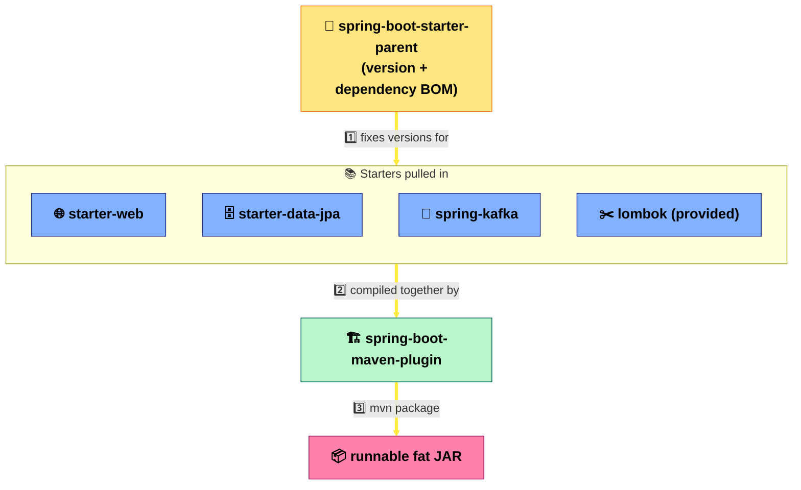

**🏗️ System Design Angle:** Starters are "curated dependency contracts" — the same idea behind platform teams publishing internal SDKs so every microservice pulls a consistent, tested set of libraries instead of each team hand-picking versions (avoids dependency hell across a fleet of services).

**Interview question this preps you for:** *"What's the difference between `spring-boot-starter-parent` and a BOM (`spring-boot-dependencies`) — and why would a multi-module project prefer one over the other?"*

**One-liner:** Starters are curated dependency bundles that let Maven build a self-contained, runnable Spring Boot jar without manual version juggling.

---

<a name="ch2"></a>
## 🚀 Chapter 2: Application Bootstrap — `@SpringBootApplication`

**Plain English:** One annotation, three jobs rolled into one: "scan my package for components," "auto-configure Tomcat/JPA/Kafka based on what's on the classpath," and "this class itself can also declare beans." `main()` just hands control to Spring, which builds the entire object graph (the **ApplicationContext**) before your app is "up."

**Where in code:** `DemoApplication.java` — `@SpringBootApplication` on the class, `SpringApplication.run(DemoApplication.class, args)` in `main`.

**Diagram:**
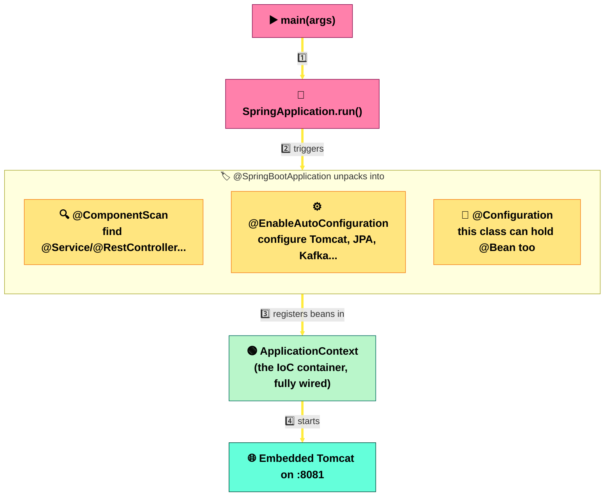

**🏗️ System Design Angle:** Auto-configuration is "convention over configuration" at the framework level — the same principle that lets a 12-factor app boot identically in dev/staging/prod with only *config* changing, not code. It's also why a single Boot service can act as its own deployable unit in a microservice fleet, with no external app-server needed.

**Interview question this preps you for:** *"What three annotations does `@SpringBootApplication` combine, and what would break if you removed `@EnableAutoConfiguration` but kept the other two?"*

**One-liner:** `@SpringBootApplication` = `@ComponentScan` + `@EnableAutoConfiguration` + `@Configuration`, and `SpringApplication.run()` is what actually builds the ApplicationContext and starts the embedded server.

---

<a name="ch3"></a>
## 🔌 Chapter 3: Inversion of Control & Dependency Injection

**Plain English:** Normally *your code* creates its own dependencies (`new HttpUrlConnectionService()`). With Spring, you just declare "I need one of these" and the **container** hands you an already-built instance. Control over object creation is inverted — from your class to the framework. This repo uses both injection styles side by side.

**Where in code:** `EarthService.java` — constructor injection of `HttpUrlConnectionService` + `MicroserviceConfig` (preferred style). `DemoScopeController.java` / `ValidateSourceService.java` — `@Autowired` field injection of `SingletonScopeService` / `CustomerRepository`.

**Diagram:**
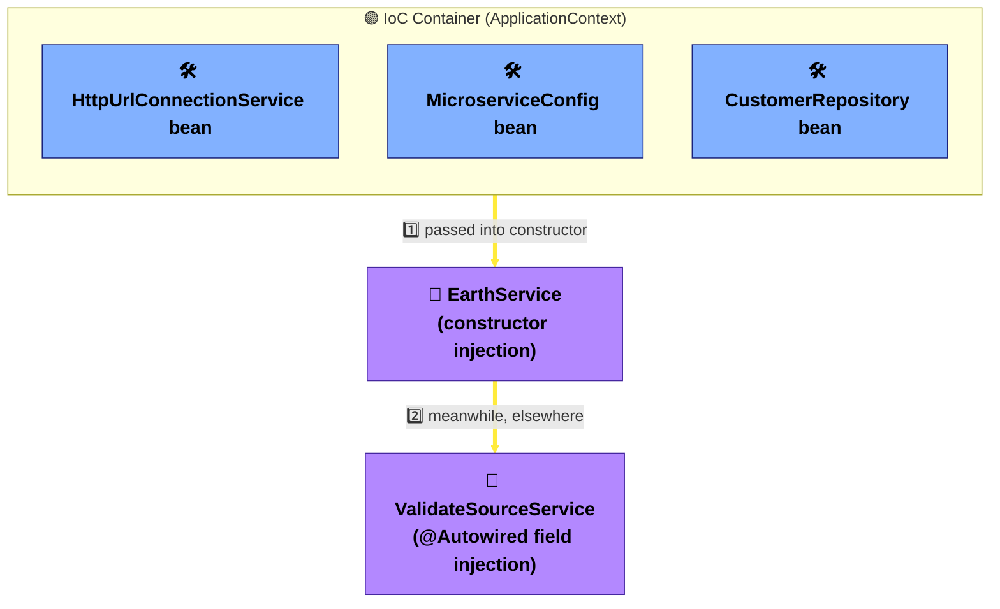

**🏗️ System Design Angle:** DI is what makes components *loosely coupled and independently testable* — you can swap `HttpUrlConnectionService` for a mock, or later for a `RestTemplate`/`WebClient` implementation, without touching `EarthService`. That's the same substitutability principle behind service interfaces, feature flags, and plug-in architectures in larger distributed systems.

**Interview question this preps you for:** *"Why is constructor injection generally preferred over field injection — think immutability, testability, and circular dependency detection?"*

**One-liner:** DI means Spring builds your objects' dependencies and hands them over, so classes depend on abstractions/interfaces instead of manually constructing collaborators — which is what makes them swappable and unit-testable.

---

<a name="ch4"></a>
## 🏷️ Chapter 4: Stereotype Annotations

**Plain English:** `@Component` is the generic "please manage this bean" annotation. `@Service`, `@RestController`, `@Configuration`, and `@ControllerAdvice` are all *specialized flavors* of `@Component` — they tell both Spring and the next developer what role a class plays, purely through the annotation name.

**Where in code:** `@Service` — `EarthService`, `LightService`, `VehicleService`, `ValidateSourceService`. `@RestController` — `EarthController`, `LightController`, `VehicleController`, `WriteController`. `@Configuration` — `KafkaConfig`, `MicroserviceConfig`. `@ControllerAdvice` — `GlobalException`.

**Diagram:**
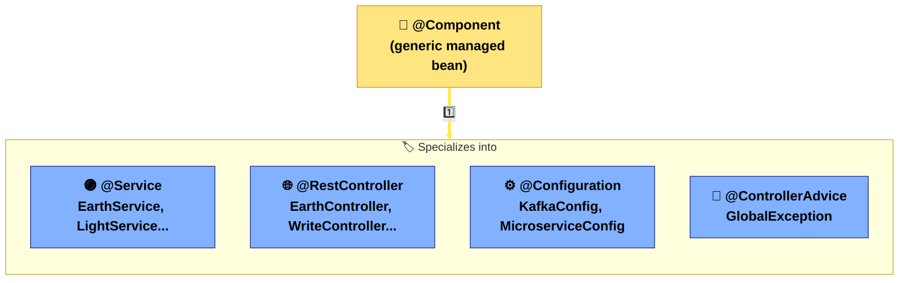

**🏗️ System Design Angle:** Stereotypes enforce a layered architecture (controller → service → repository) by convention, not just by folder name. That layering is what lets you later split "controller" and "service" across process boundaries (e.g. API gateway calling a backend service) with minimal code shock.

**Interview question this preps you for:** *"Is `@RestController` a stereotype in its own right, or a composition of others — and what does it add on top of `@Controller`?"*

**One-liner:** Stereotype annotations are all specialized `@Component`s — the specific name (`@Service`, `@RestController`, `@Configuration`) documents the class's architectural role and enables Spring to apply role-specific behavior.

---

<a name="ch5"></a>
## ⚙️ Chapter 5: `@Configuration` & `@Bean` — Manual Wiring

**Plain English:** Spring can auto-detect your own `@Service` classes via scanning. But it can't guess how to build a third-party object like a Kafka `KafkaTemplate` — you have to write a method that constructs it and hand it to Spring with `@Bean`. A class marked `@Configuration` is just a factory for such beans.

**Where in code:** `KafkaConfig.java` — `@EnableKafka @Configuration` class with `@Bean producerFactory()` and `@Bean kafkaTemplate()`. `MicroserviceConfig.java` — `@Configuration` bean whose `@Value`-injected fields feed `getMicroserviceBaseUrl()` (this bean is also injected into other services, like any other bean).

**Diagram:**
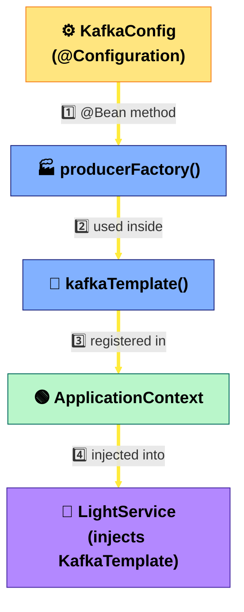

**🏗️ System Design Angle:** `@Configuration`/`@Bean` classes are the app's "composition root" — the one place wiring decisions (which serializer, which broker, which base URL) live, decoupled from business logic. In a bigger system this is exactly where you'd swap a real Kafka cluster for a test broker, or point at a different microservice host, without touching a single `@Service`.

**Interview question this preps you for:** *"When would you use `@Bean` methods in a `@Configuration` class instead of just annotating the class itself with `@Component`?"* (Answer: when you don't own the class's source — third-party types like `KafkaTemplate`, `RestTemplate`, `ObjectMapper`.)

**One-liner:** `@Configuration` classes are bean *factories* for objects Spring can't auto-detect by scanning — you build them once in a `@Bean` method and the container manages their lifecycle from there on.

---

<a name="ch6"></a>
## 🌍 Chapter 6: Externalized Configuration (`@Value` & `application.properties`)

**Plain English:** Hard-coding a hostname or DB password into Java means recompiling to change environments. Instead, values live in `application.properties`, and `@Value("${...}")` pulls them into a field at startup. Change the property file (or an env var) and the behavior changes — no code touched.

**Where in code:** `application.properties` — `target.microservice.*`, `spring.datasource.*`, `spring.kafka.listener.auto-startup` (credentials redacted here for safety). `KafkaConfig.java` — `@Value("${spring.kafka.listener.auto-startup:true}")` (note the `:true` inline default). `MicroserviceConfig.java` — `@Value("${target.microservice.host}")`.

**Diagram:**
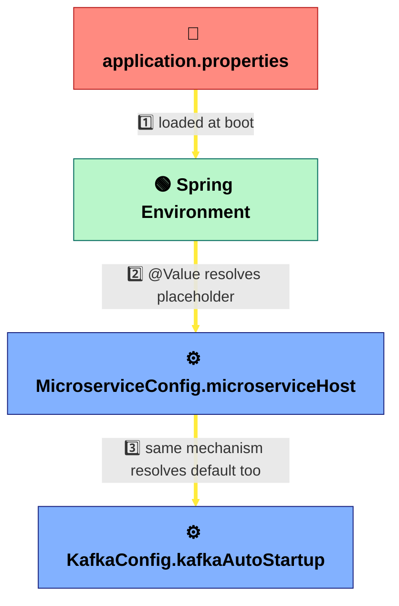

**🏗️ System Design Angle:** This is textbook **12-factor "config in the environment"** — the same jar can run in dev pointing at `localhost:8082` and in prod pointing at a real service-mesh hostname, purely by swapping property values (or overriding with env vars/`-D` flags). It's what makes the same artifact promotable across environments without rebuilding.

**Interview question this preps you for:** *"How would you override `target.microservice.host` in production without touching `application.properties` — and in what order does Spring resolve property sources?"*

**One-liner:** `@Value("${...}")` externalizes configuration so the same compiled artifact behaves differently per environment, which is core to 12-factor app design.

---

<a name="ch7"></a>
## ♻️ Chapter 7: Bean Scopes — Singleton vs Prototype

**Plain English:** By default, Spring makes **one instance** of every bean for the whole application (singleton) — shared by everyone, forever. Sometimes you want a **fresh instance every time** (prototype) — e.g. something that must carry its own unique ID/timestamp per use. Because the *controller itself* is a singleton, you can't just `@Autowired` a prototype bean directly (it would get created once and frozen) — you need an `ObjectFactory` to ask the container for a brand-new instance on demand.

**Where in code:** `SingletonScopeService.java` (default scope) vs `PrototypeScopeService.java` (`@Scope("prototype")`) — both stamp a UUID in the constructor. `DemoScopeController.java` — injects the prototype bean via `ObjectFactory<PrototypeScopeService>` and calls `.getObject()` per request to get a fresh instance.

**Diagram:**
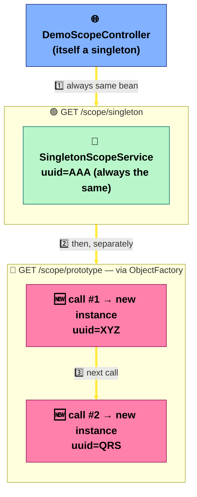

**🏗️ System Design Angle:** This is the DI-container version of a broader distributed-systems tension: **shared mutable state vs. per-request isolation**. Singleton beans model shared, stateless-service instances (safe to scale horizontally because nothing per-request sticks around); prototype beans model per-request/session state that must never leak between callers — the same reasoning behind "never store request-specific data on a stateless service instance."

**Interview question this preps you for:** *"Why can't you just `@Autowired` a prototype-scoped bean directly into a singleton controller field, and what are the two standard fixes (`ObjectFactory`/`Provider` vs scoped proxy)?"*

**One-liner:** Singleton is one shared instance for the app's whole life; prototype is a new instance per request — and injecting a prototype into a singleton safely requires an `ObjectFactory`/`Provider`, not a plain field.

---

<a name="ch8"></a>
## 🌐 Chapter 8: REST Controllers & Request Mapping

**Plain English:** `@RestController` tells Spring "every method's return value is JSON on the HTTP response body," not an HTML view. `@RequestMapping` sets a base path; `@GetMapping`/`@PostMapping`/`@PutMapping` map specific HTTP verbs to methods. `@PathVariable` pulls a value out of the URL, `@RequestBody` deserializes the JSON body into a Java object, and `ResponseEntity<T>` lets you control the exact status code returned.

**Where in code:** `EarthController.java` — `@RequestMapping("/api/earth")`, `@GetMapping("/planets/{name}")` with `@PathVariable`. `ValidateSource.java` — `@PostMapping("/customers")` with `@RequestBody` and `ResponseEntity.status(HttpStatus.CREATED)`.

**Diagram:**
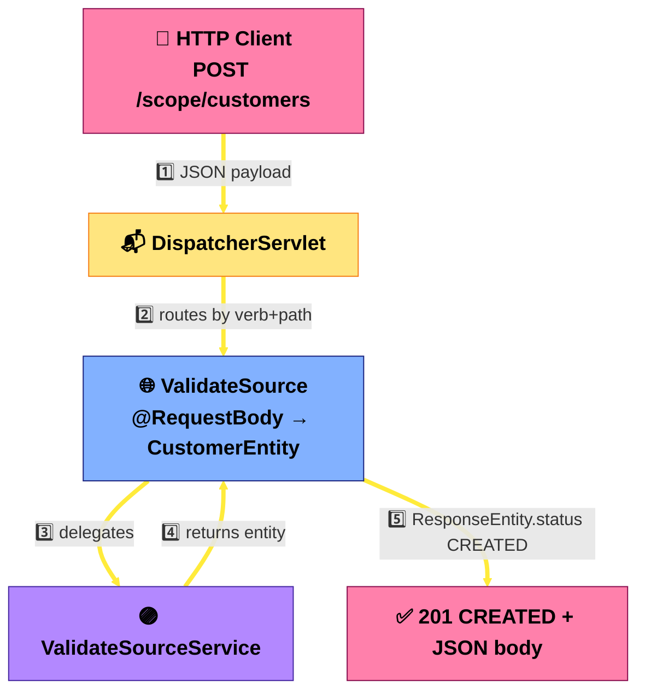

**🏗️ System Design Angle:** Explicit `ResponseEntity` status codes + resource-oriented paths (`/api/earth/planets/{name}`) are what make an API a proper **contract** other teams/services can code against — this is the foundation of stateless, cacheable, independently-deployable REST services in a microservice mesh.

**Interview question this preps you for:** *"What's the difference between `@Controller` and `@RestController`, and why does returning a plain `String` from a `@RestController` method not render a view?"*

**One-liner:** `@RestController` + `@RequestMapping` family turns Java methods into an HTTP API, with `@PathVariable`/`@RequestBody` extracting input and `ResponseEntity` controlling the exact status/body of the response.

---

<a name="ch9"></a>
## 📦 Chapter 9: DTOs, Lombok & the Builder Pattern

**Plain English:** Writing getters/setters/constructors by hand for every class is repetitive. Lombok annotations generate that boilerplate at compile time. DTOs (Data Transfer Objects) are plain data-holder classes used to shape what goes over the wire (`LightRequestDTO`) — kept separate from JPA `@Entity` classes so your database schema and your API shape can evolve independently.

**Where in code:** `HttpRequestConfig.java` — `@Data @Builder @NoArgsConstructor @AllArgsConstructor`; built via `HttpRequestConfig.builder()...build()` inside `EarthService.java`. `ImmutableCLS.java` — Lombok's `@Value` (immutable, final fields, no setters) + `@Builder` — **not** the same `@Value` as Spring's property-injection annotation from Chapter 6.

**Diagram:**
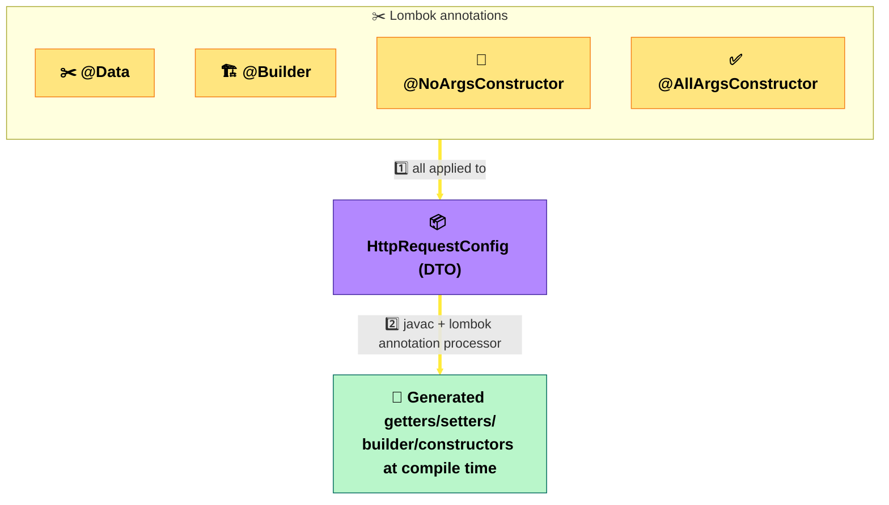

**🏗️ System Design Angle:** Keeping DTOs separate from `@Entity` classes decouples your **wire contract** from your **storage schema** — you can change a database column without breaking every client, and vice versa. This is the same "interface vs implementation" separation that lets an API version evolve independently of the underlying data model.

**Interview question this preps you for:** *"`lombok.Value` and `org.springframework.beans.factory.annotation.Value` share a name but do completely unrelated things — what does each one actually do?"*

**One-liner:** Lombok annotations generate boilerplate (getters/builders/constructors) at compile time, and DTOs built with them keep the API's wire format decoupled from the JPA entity/storage model.

---

<a name="ch10"></a>
## 🚨 Chapter 10: Global Exception Handling

**Plain English:** Instead of wrapping every controller method in try/catch, one class marked `@ControllerAdvice` intercepts exceptions thrown by *any* controller in the app. Each `@ExceptionHandler` method says "if this exception type escapes, run me instead," and `@ResponseStatus` sets the HTTP status code that goes with it.

**Where in code:** `GlobalException.java` — `@ControllerAdvice` class with `@ExceptionHandler(ResourceNotFoundException.class)` → 404 and a catch-all `@ExceptionHandler(Exception.class)` → 500, each set via `@ResponseStatus`.

**Diagram:**
```mermaid
flowchart TD
    classDef controller fill:#82B1FF,stroke:#1A237E,color:#000,font-weight:bold,font-size:19px;
    classDef advice fill:#FF8A80,stroke:#B71C1C,color:#000,font-weight:bold,font-size:19px;
    classDef resp fill:#B9F6CA,stroke:#00695C,color:#000,font-weight:bold,font-size:19px;

    A["🌐 Any @RestController"]:::controller
    T["💥 throws ResourceNotFoundException"]:::advice
    G["🚨 GlobalException<br/>(@ControllerAdvice)"]:::advice
    R1["📮 404 + {\"error\": msg}"]:::resp
    R2["📮 500 + {\"server error\": msg}"]:::resp

    A -->|1️⃣ business logic fails| T
    T -->|2️⃣ intercepted by| G
    G -->|3️⃣ specific handler matched| R1
    R1 -->|4️⃣ otherwise, generic fallback| R2

    linkStyle default stroke:#FFEB3B,stroke-width:4px;
```

**🏗️ System Design Angle:** Centralized exception-to-status mapping is what turns internal Java exceptions into a **consistent, predictable error contract** for API consumers — critical when multiple client teams (or other services) depend on your error shape, and part of why well-designed APIs never leak stack traces to callers.

**Interview question this preps you for:** *"How does Spring pick which `@ExceptionHandler` method runs when an exception matches more than one handler's type — what's the specificity rule?"*

**One-liner:** `@ControllerAdvice` + `@ExceptionHandler` centralizes error handling across every controller, turning raw exceptions into a consistent HTTP status + JSON error contract.

---

<a name="ch11"></a>
## 🗄️ Chapter 11: Spring Data JPA — Entities & Repositories

**Plain English:** `@Entity` marks a class as "this maps to a database table," with `@Id`/`@GeneratedValue` for the primary key and `@Column` for field-to-column mapping. The really magic part is `JpaRepository<Entity, IdType>` — just *extending* that interface gives you `save()`, `findById()`, `findAll()`, `delete()` for free, no implementation written. Even a method you never implemented, like `findByEmail(String email)`, works — Spring Data parses the method name and generates the query.

**Where in code:** `CustomerEntity.java` — `@Entity @Table(name = "customer")`, `@Id @GeneratedValue(strategy = GenerationType.IDENTITY)`, `@Column(unique = true)` on `email`. `CustomerRepository.java` — `extends JpaRepository<CustomerEntity, Long>` plus the derived query `findByEmail(String email)`.

**Diagram:**
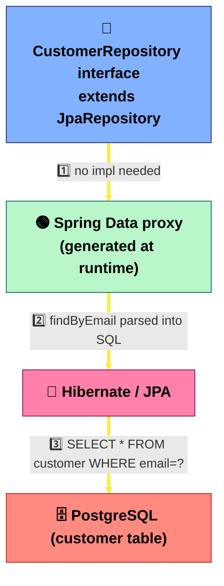

**🏗️ System Design Angle:** Repository abstraction hides the persistence mechanism behind an interface — the classic **Repository pattern** that lets you swap storage engines, add caching, or move to CQRS read replicas later without rewriting service-layer code that calls `customerRepository.findAll()`.

**Interview question this preps you for:** *"How does Spring Data JPA generate a working query for `findByEmail(String email)` when you never wrote any SQL or JPQL?"*

**One-liner:** `JpaRepository<Entity, Id>` gives you full CRUD for free, and Spring Data can derive real queries straight from a method's name — no SQL required for the common cases.

---

<a name="ch12"></a>
## 🔒 Chapter 12: Transactional Service Layer

**Plain English:** `@Transactional` wraps a method in a database transaction: if everything inside succeeds, it commits as one atomic unit; if an exception is thrown partway through, everything rolls back — you never end up with half-saved data.

**Where in code:** `ValidateSourceService.java` — `@Transactional` on `createCustomer`, `updateCustomer`, and `getAllCustomers`.

**Diagram:**
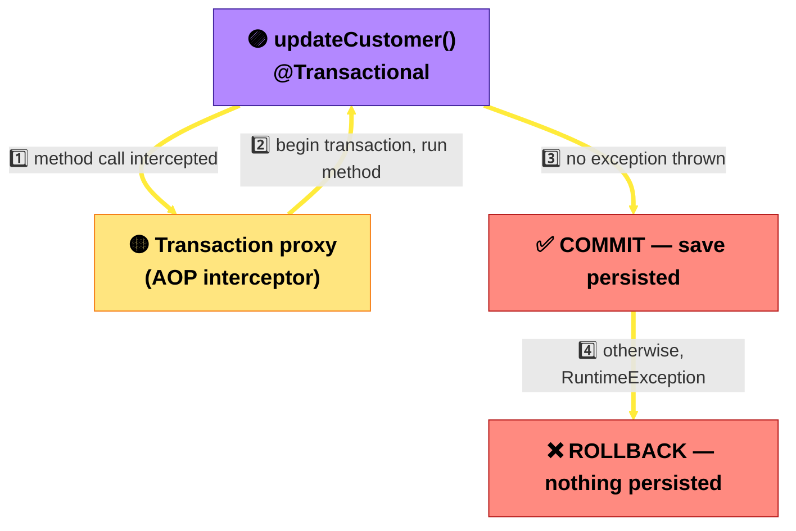

**🏗️ System Design Angle:** `@Transactional` gives you **ACID guarantees within one service/database** — but the moment you split work across two services (e.g. update the customer *and* publish a Kafka event), a local transaction can't cover both. That's exactly the gap the **Saga pattern** / outbox pattern exists to solve in distributed systems — a great follow-up talking point.

**Interview question this preps you for:** *"`@Transactional` works fine for a single database — what breaks when you need atomicity across a database write *and* a Kafka publish, and how do patterns like the transactional outbox address it?"*

**One-liner:** `@Transactional` wraps a method in a proxy that commits on success and rolls back on exception, guaranteeing atomicity for that one method's database work.

---

<a name="ch13"></a>
## 📨 Chapter 13: Event-Driven Messaging with Spring Kafka

**Plain English:** Instead of one service calling another directly over HTTP and waiting, it can drop a message on a Kafka **topic** and move on — some other service (maybe seconds later, maybe on a different machine) picks it up whenever it's ready. `KafkaTemplate` sends; `@KafkaListener` receives. This repo has both sides: `LightService` publishes to `blackhole-requests`, and `EarthKafkaListenerService` consumes from `blackhole-responses`.

**Where in code:** `KafkaConfig.java` — `@Bean kafkaTemplate()`. `LightService.java` — `kafkaTemplate.send("blackhole-requests", light)`. `EarthKafkaListenerService.java` — `@KafkaListener(topics = "blackhole-responses", groupId = "earth-group")`.

**Diagram:**
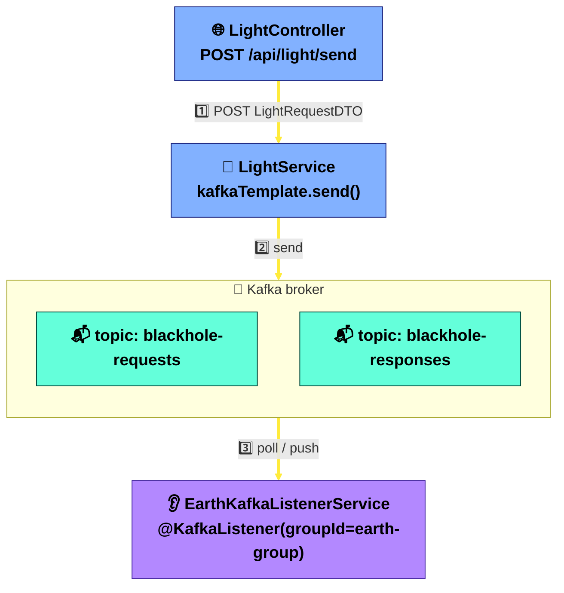

**🏗️ System Design Angle:** This is **event-driven architecture** in miniature: producer and consumer never call each other directly, are deployable independently, and the broker buffers load spikes so a slow consumer doesn't take down the producer. `spring.kafka.listener.auto-startup=false` in `application.properties` also shows a common production trick — feature-flagging a listener off via config without touching code.

**Interview question this preps you for:** *"What does the Kafka consumer `groupId` control, and what happens to message delivery if you scale `EarthKafkaListenerService` to 3 instances all sharing `groupId=earth-group`?"*

**One-liner:** `KafkaTemplate` (producer) and `@KafkaListener` (consumer) decouple services in time and process — the sender doesn't wait for or even know about the receiver, which is the core of event-driven, asynchronously-scalable architecture.

---

<a name="ch14"></a>
## 🧪 Chapter 14: Testing with `@SpringBootTest`

**Plain English:** `@SpringBootTest` boots the *entire* Spring application context for a test — same beans, same wiring, same auto-configuration as production. The simplest possible test, `contextLoads()`, asserts nothing explicitly — if any bean fails to wire (a missing property, a broken `@Bean` method, a circular dependency), the test fails just by the context refusing to start.

**Where in code:** `DemoApplicationTests.java` — `@SpringBootTest` class with an empty `contextLoads()` test.

**Diagram:**
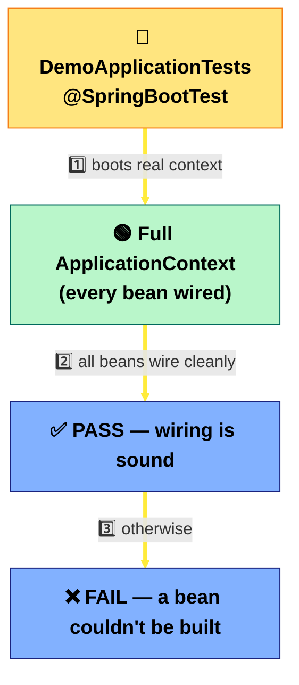

**🏗️ System Design Angle:** A green `contextLoads()` test is a cheap, fast **smoke test** — exactly the kind of check that belongs early in a CI/CD pipeline, catching "the app doesn't even start" failures before slower integration or end-to-end tests run.

**Interview question this preps you for:** *"`@SpringBootTest` boots the full context, which can be slow for a large app — what's the difference between it and slicing annotations like `@WebMvcTest` or `@DataJpaTest`, and when would you reach for those instead?"*

**One-liner:** `@SpringBootTest` verifies the whole application context wires up correctly — it's a smoke test for "does the app even start," not a substitute for focused unit tests.

---

<a name="ch15"></a>
## 🧩 Chapter 15: Bringing It All Together — Spring ↔ System Design Map

**Plain English:** Every Spring trick in this repo is a small, local stand-in for a bigger distributed-systems idea. Learning to say the mapping out loud is what separates "I used the annotation" from "I understand why it exists" in an interview.

**The whole app, one diagram (read top to bottom):**
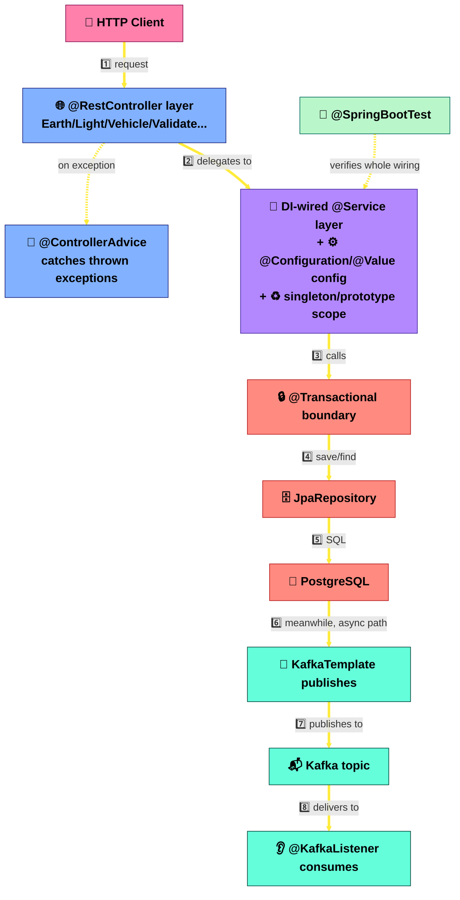

**Cheat sheet — Spring concept → System design concept:**

| Spring concept (this repo) | System design concept | Why it matters in an interview |
|---|---|---|
| DI / `@Autowired` / constructor injection | Loose coupling, substitutable dependencies | Enables mocking, swapping implementations, testability |
| `@Configuration` + `@Bean` | Composition root | Central place to change wiring without touching business logic |
| `@Value` + `application.properties` | 12-factor config, environment parity | Same artifact runs unmodified across dev/staging/prod |
| Singleton scope | Stateless, horizontally-scalable service instances | Safe to run N replicas behind a load balancer |
| Prototype scope + `ObjectFactory` | Per-request/session isolation | Prevents state leaking across concurrent callers |
| `@RestController` + `ResponseEntity` | API contract / resource-oriented interface | Lets independent teams/services integrate against a stable contract |
| `@ControllerAdvice` / `@ExceptionHandler` | Centralized error contract | Consumers get predictable errors, no leaked internals |
| `JpaRepository` | Repository pattern / persistence abstraction | Swap storage engine or add caching without touching service code |
| `@Transactional` | ACID guarantees, single-service atomicity | Sets up the "why Sagas exist" conversation for cross-service atomicity |
| `KafkaTemplate` / `@KafkaListener` | Event-driven architecture, async decoupling | Producer/consumer scale and deploy independently; broker absorbs bursts |
| `@SpringBootTest` | CI smoke testing | Fast, cheap gate before slower test/deploy stages |
| Maven starters | Curated dependency management | Consistent library versions across a fleet of services |

**🏗️ System Design Angle:** The recurring theme across every chapter is **decoupling** — of object creation (DI), of configuration from code (`@Value`), of API shape from storage shape (DTO vs Entity), of error format from business logic (`@ControllerAdvice`), and of producer from consumer (Kafka). Distributed systems design is largely the same set of decoupling instincts, just applied across process and network boundaries instead of class boundaries.

**Interview question this preps you for:** *"Pick any one annotation in this app and explain what distributed-systems problem it would help you solve if this monolith were split into three microservices."*

**One-liner:** Almost every Spring annotation is a small-scale rehearsal for a system design principle — master the annotation, and you've already understood the bigger idea it's standing in for.

---

<a name="ch16"></a>
## 🎯 Chapter 16: Worked Interview Answer — Fetching All Active Customers

📡 **Asked verbatim:** Glassdoor — TCS Java Developer interview, Dec 2025: *"Write code for fetching data from database."* Chapters 4, 8, and 11 cover Repository/Service/Controller in isolation — this is the same answer stitched end to end, using the entity/repository/service/controller that **already existed** for this (`CustomerEntity` already had `isActive`) instead of inventing a new one.

**Plain English:** This question tests whether you know *where each responsibility lives*, not whether you can invent a new class. One derived-query method on the existing repository, one pass-through method on the existing service, one endpoint on the existing controller.

**Where in code:** `CustomerRepository.java` — added `findByIsActiveTrue()`. `ValidateSourceService.java` — added `getAllActiveCustomers()`, calling that repository method. `ValidateSource.java` — added `GET /scope/customers/active`, calling that service method. No new files.

`findByIsActiveTrue()` is the same **derived query method** mechanism as this file's existing `findByEmail()` — Spring Data parses the method name into `SELECT * FROM customer WHERE is_active = true` at startup, no SQL/JPQL written.

**Diagram:**
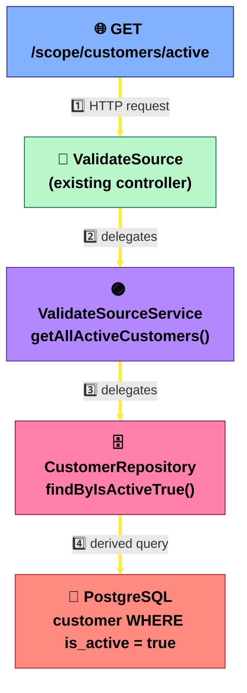

**🏗️ System Design Angle:** Reusing the existing repository/service/controller instead of standing up a parallel `User` stack is the same instinct as avoiding duplicate services in a real system — one source of truth for "customer," one place the "active" business rule lives. It's also the setup for a common follow-up: returning `@Entity` objects directly from a controller (as done here) leaks your DB schema as your API contract — the fix is a DTO layer between Entity and Controller (see Chapter 9).

**Interview question this preps you for:** *"What's the problem with returning `@Entity` objects directly from a `@RestController`, and how would you fix it?"*

**One-liner:** Answer a "fetch active X" question by adding one derived-query method to the existing repository, one pass-through method to the existing service, and one endpoint to the existing controller — not a parallel entity/repo/service/controller stack.

**See also:** `D:\Le\Springboot Gradle Lab\Springboot Gradle Lab.md`, Chapter 14 (JPA/ORM) — that service already has JPA entities and repositories written (`BaseEntity`, `ApiAudit`, `WeatherData`, `HostelRepository`/`ApiAuditRepository`/`WeatherRepository`) but `spring-boot-starter-data-jpa` is still commented out in its `build.gradle`, so those classes can't currently compile — unlike this chapter's `CustomerRepository`, which is fully wired to a live Postgres instance. Same concept, opposite wiring state.
